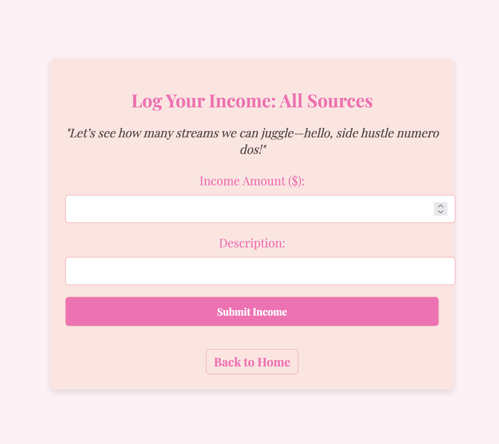

# MoneyMate
MoneyMate is a simple, web-based personal finance tracker that helps users log income and expenses, set budgets, and track savings goals. Built with Flask and styled with a feminine, pink-themed design, MoneyMate is ideal for individuals who want an intuitive and elegant way to manage their finances.

## Table of Contents
- [Features](#features)
- [Project Structure](#project-structure)
- [Technologies Used](#technologies-used)
- [Setup Instructions](#setup-instructions)
- [Usage Guide](#usage-guide)
- [Styling](#styling)
- [Troubleshooting](#troubleshooting)
- [Contributing](#contributing)
- [License](#license)
## Features

- **Log Income:** Easily record income entries with amount and description.
- **Log Expenses:** Track expenses by amount, category, and description.
- **Set Budgets:** Define budgets for spending categories and monitor spending against set limits.
- **Set Savings Goals:** Set and track progress toward specific financial goals with customs goal names and targets.
- **View Financial Summary:** Get an overview of total income, total expenses, budget usage, and savings goal progress.
---

## Screenshots

### **Home Page**
The home page welcomes users with an inviting message and simple navigation to all major features.


---

### **Log Income Page**
Users can record their income streams with descriptions to track all sources of income effectively.



---

### **Financial Summary**
The summary page provides an overview of total income, expenses, and savings goals, along with a colorful pie chart to visualize spending by category.


## Project Structure

```plaintext
MoneyMate/
│
├── app.py                  # Main Flask application file
├── moneymate_data.json     # JSON file for data storage
├── templates/              # HTML templates folder
│   ├── index.html          # Homepage
│   ├── log_income.html     # Log income page
│   ├── log_expense.html    # Log expense page
│   ├── set_budget.html     # Set budget page
│   ├── set_goal.html       # Set savings goal page
│   └── summary.html        # Financial summary page
└── static/                 # Static files folder
    └── style.css           # CSS file for styling
```
## Technologies Used
- **Backend:** Flask (Python)
- **Frontend:** HTML, CSS
- **Data Storage:** JSON file (`moneymate_data.json`)
- **Styling:** Google Fonts (Playfair Display), Custom CSS
## Setup Instructions

### Prerequisites

- **Python 3.x** is required. Install Python from [python.org](https://www.python.org/downloads/) if you haven’t already.
- **pip** (Python package manager) should be installed along with Python.

### 1. Clone the Repository

```bash
git clone https://github.com/your-username/MoneyMate.git
cd MoneyMate
```

### 2. Install Flask

Install Flask using pip:

```bash
pip install flask
```

### 3. Run the Application

Start the Flask server by running:

```bash
python app.py
```

You should see output indicating that the Flask server is running, with a message like this:

```plaintext
* Running on http://127.0.0.1:5000/ (Press CTRL+C to quit)
```

### 4. Open the Application

In your web browser, navigate to [http://127.0.0.1:5000](http://127.0.0.1:5000) to access the MoneyMate app.

## Usage Guide

### Homepage

On the homepage, you’ll find links to navigate through different functionalities:

- **Log Income**
- **Log Expense**
- **Set Budget**
- **Set Savings Goal**
- **View Summary**
### Log Income

Use this page to record income entries. Enter the amount and an optional description, then submit to save the entry.

### Log Expense

Record expenses by entering the amount, category (e.g., Food, Transport), and an optional description. Submit to save the entry.

### Set Budget

Define spending limits for different categories. Specify a category and the budget amount, then submit to save.

### Set Savings Goal

Set financial goals by entering a goal name and target amount. Track your savings progress over time.

### View Summary

Get an overview of your financial status, including:
- Total income and expenses
- Expenses by category
- Budget usage for each category
- Savings goals progress

## Styling

MoneyMate features a pink-themed, feminine design with the *Playfair Display* font. All styling is handled in `static/style.css`. To customize the look and feel, modify this CSS file as needed.

## Troubleshooting

If you encounter issues, try these steps:
- Ensure Flask is installed: `pip install flask`
- Restart the Flask server after making code changes.
- Clear your browser cache or try opening the site in an incognito window.

## Contributing

Contributions are welcome! To contribute:
1. Fork the repository.
2. Create a feature branch: `git checkout -b feature-branch-name`.
3. Commit your changes: `git commit -m "Add new feature"`.
4. Push to the branch: `git push origin feature-branch-name`.
5. Open a pull request.

## License

This project is licensed under the MIT License.
## Notable Commits
- ** Updated README.md**: https://github.com/ksu-is/MoneyMate/commit/cdf5aa42f357e53c6e534429037b7296305f9ca5

